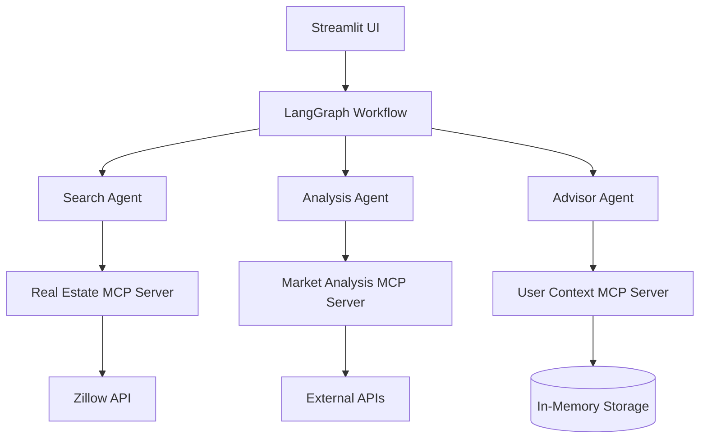
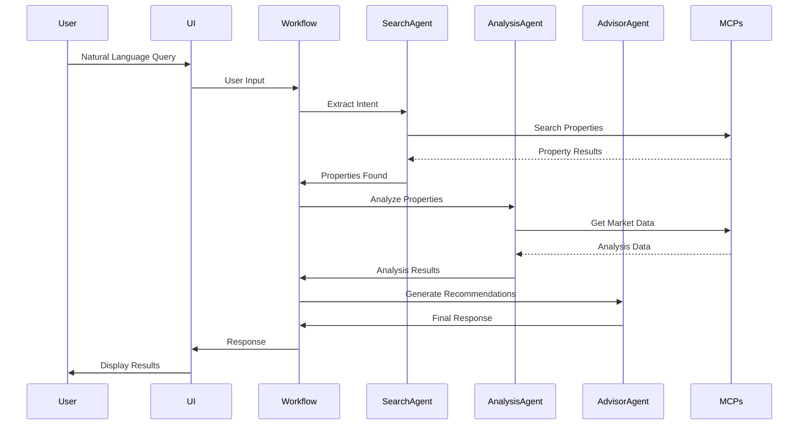

# Architecture Documentation

## System Overview

The Real Estate AI Assistant is a multi-agent system that uses LangGraph for orchestration and custom MCP (Model Context Protocol) servers for data access. The system is designed to help users find and analyze real estate properties through natural language conversation.

## Component Diagram

## Data Flow

## MCP Server Architecture

Each MCP server follows a consistent pattern:

1. **FastMCP Framework**: Uses FastMCP for server implementation
2. **Tool Definitions**: Each server exposes multiple tools
3. **Data Validation**: Pydantic models for input/output
4. **Error Handling**: Comprehensive error handling with logging
5. **Caching**: Response caching where appropriate
6. **Rate Limiting**: API rate limiting for external services

## Agent System Architecture

### Base Agent

All agents inherit from `BaseAgent` which provides:
- LLM initialization (Anthropic Claude)
- MCP client connections
- Logging setup
- Error handling framework

### Specialized Agents

1. **Search Agent**: Extracts search criteria from natural language and queries the Real Estate MCP server
2. **Analysis Agent**: Analyzes properties using market data from the Market Analysis MCP server
3. **Advisor Agent**: Synthesizes information and provides recommendations

## LangGraph Workflow

The workflow is defined as a state machine with the following nodes:

1. **understand_intent**: Parse user input and extract search criteria
2. **search_properties**: Execute property search
3. **analyze_properties**: Analyze found properties
4. **generate_recommendations**: Create final recommendations
5. **handle_clarification**: Request additional information if needed

## Technology Choices & Rationale

- **LangGraph**: Provides state machine orchestration for multi-agent systems
- **FastMCP**: Modern Python framework for MCP server implementation
- **Anthropic Claude**: High-quality reasoning for agent decision-making
- **Streamlit**: Rapid UI development for demos
- **Pydantic**: Type-safe data validation
- **pytest**: Comprehensive testing framework

## Scalability Considerations

- MCP servers can be scaled independently
- Agents are stateless and can be horizontally scaled
- Caching reduces API calls
- Async/await for concurrent operations

## Security Considerations

- API keys stored in environment variables
- No hardcoded credentials
- Input validation on all user inputs
- Rate limiting to prevent abuse

